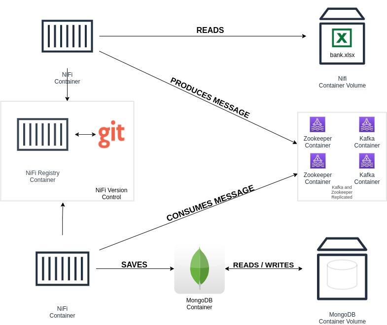

# POC - Speed Layer - Open Banking

Instruções de como executar esta POC.

## Visão Geral da Arquitetura

## Software Necessário

 1. **Git** instalado e configurado adequadamente.
 2. **Docker**.
 3. **Docker Compose**.

## Configuração

1 -  Certifique-se te possuir sua chave SSH configurada em sua conta do Git. *Para mais informações: https://tinyurl.com/3tw839jj*

 - Não utilize senhas durante a criação da chave SSH!
 
2 - Clone **este** repositório. *Para mais informações: https://tinyurl.com/6bhk89tz*

3 - Substitua os comentários em docker-compose.yml com as suas próprias informações:
 
 - Mapeamento do volume do NiFi Registry: Diretório da sua chave ssh.
 - Seu nome.
 - Endereço de e-mail relacionado à sua conta do GitHub.

## Preparação

1 - Em um terminal, abra o diretório raiz do projeto.

2 - Execute: `sudo docker-compose up -d` .  *A primeira execução deste comando pode levar vários minutos.*

### Acesse as duas instâncias de NiFi
**Instância 1:** `http://localhost:8080/nifi`

**Instância 2:** `http://localhost:9090/nifi`

### Em cada instância:
Controller Settings -> Registry Clients -> Add:

**Name:** *Nifi Registry*, **URL:** *http://nifi-registry:18080*

Em seguida: Botão direito do mouse no canvas -> Refresh.

### Na instância 1:
Add Process Group -> Import:

**Bucket:** *message-producer*, **Flow Name:** *message-producer*.

### Na instância 2:
Add Process Group -> Import:

**Bucket:** *message-consumer*, **Flow Name:** *write-to-mongo*.

## Execução
**Em cada instância:**  Inicie os processadores do Process Group recém importado.

 - O arquivo speed-layer/nifi_file/input/bank.xlsx será consumido pela **Instância 1**.
 
 Acesse o contêiner do MongoDB. Para isso, em um terminal, execute os seguintes comandos:

    sudo docker exec -it mongodb /bin/bash
        
    mongo

    use banking

    db.transactions.find().pretty()

Para verificar a quantidade de registros inseridos:
`db.transactions.count()`

Verifique que os registros da planilha estão sendo/foram inseridos.

## Encerrar
Há diversas maneiras de parar os contêineres. Rode algum dos seguintes comandos no diretório raiz do projeto: 

1 - Apenas para os contêineres. Nenhum dado é perdido:

`sudo docker-compose stop`

2 - Para os contêineres e os destrói: (Com exceção dos dados do MongoDB, todos os dados serão perdidos. Para também excluir os dados do MongoDB, exclua o seguinte diretório: `speed-layer/mongo`)

`sudo docker-compose down`

