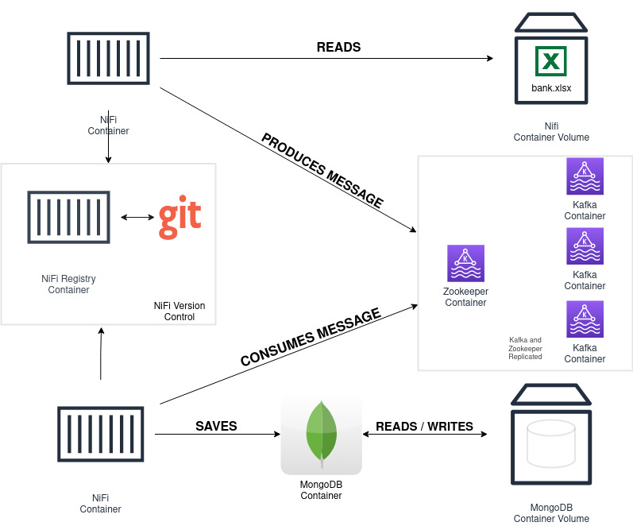

# POC - Speed Layer - Open Banking

Instruções de como subir e executar esta POC.

## Visão Geral da Arquitetura

## Software Necessário

 1. **Git** instalado e configurado adequadamente.
 2. **Docker**.
 3. **Docker Compose**.

## Configuração

1 - Solicite, ao dono deste repositório, a inclusão de seu usuário para obter acesso ao repositório: **https://github.com/imacellone/nifi-registry**

2 -  **Gere** suas **chaves SSH** para configurar o acesso ao repositório: **https://github.com/imacellone/nifi-registry**, **bem como este** repositório. *Para mais informações: https://docs.github.com/pt/github/authenticating-to-github/connecting-to-github-with-ssh.*

 - Não utilize senhas durante a criação da chave SSH!
 
 3 - Clone **este** repositório. *Para mais informações: https://git-scm.com/book/pt-pt/v2/No%C3%A7%C3%B5es-B%C3%A1sicas-do-Git-Obtendo-um-Reposit%C3%B3rio-Git.*

4 - Na raiz do projeto, há um arquivo chamado: *docker-compose.yml*. Nele, altere as configurações, indicadas pelos comentários, para o correto funcionamento deste projeto.

## Preparação

1 - Em um terminal, abra o diretório raiz do projeto.

2 - Execute: `sudo docker-compose up -d` .  *A primeira execução deste comando pode levar vários minutos.*

### Acesse as duas instâncias de NiFi
1 - `http://localhost:8080`

2 - `http://localhost:9090`

O NiFi Registry pode ser acessado no seguinte endereço: `http://localhost:18080`

**Em cada instância:**  Controller Settings -> Registry Clients -> Add:

**Name:** *Nifi Registry*, **URL:** *http://nifi-registry:18080*

Em seguida: Botão direito do mouse no canvas -> Refresh.

**Na instância 1**: Add Process Group -> Import:

**Bucket:** *message-producer*, **Flow Name:** *message-producer*.

**Na instância 2**: Add Process Group -> Import:

**Bucket:** *message-consumer*, **Flow Name:** *write-to-mongo*.

## Execução
**Em cada instância:**  Acesse o Process Group recém importado e inicie os processadores.
 - O arquivo speed-layer/nifi_file/input/bank.xlsx será consumido pela **Instância 1**.
 
 Acesse o contêiner do MongoDB e verifique que os dados da planilha foram persistidos no banco de dados. Para isso, em um terminal, execute os seguintes comandos:

    sudo docker exec -it mongodb /bin/bash
        
    mongo

    use banking

    db.transactions.find().pretty()

Verifique que os registros da planilha estão sendo/foram inseridos.

## Encerrar
Para parar todos os contêineres, basta rodar o seguinte comando no diretório raiz do projeto: 
`sudo docker-compose down`
